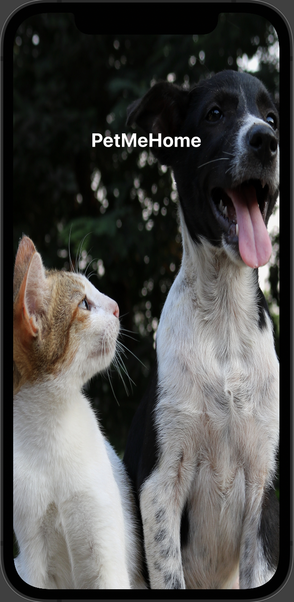

 
  

 
 
<h1 align="center">Pet Me Home</h1>

 
PetMeHome is a work in progress for self learning ios application written in Swift! Lets help get lost pets home faster to there families!

 

 
  

 
<h1 align="center">Features</h1>

* Create Account
* List Lost Pets in a given radius (miles)
* Add a lost pet
   * Name
   * Color
   * Type of Pet: Currently Cat or Dog
   * Drop Pin on map of last known location
   * Add a photo of pet

 
